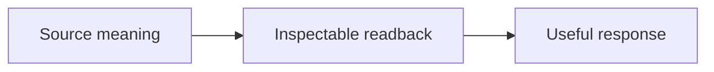

# Readback First

**0.6.0 candidate — Multiple semantic views and Mermaid**

Make the AI's working understanding inspectable before it responds or acts.
Preserve qualifiers, corrections and open items. Readback is neither factual
verification nor action authorization.

[中文](README.zh-CN.md) · [Protocol](PROTOCOL.md) · [This iteration](docs/releases/0.6.0.md) · [Version sequence](docs/release-sequence.md)

## What this version changes

- Choose separate semantic views, tables and Mermaid types from content.
- Keep inferred links labeled and qualifiers visible; use readable renderer fallbacks.

## Read back, then answer

**User:** “Can a Skill own readback while keeping it mandatory every turn? Do not edit yet.”

Readback: You want the detailed protocol in a Skill, with mandatory every-turn
application. This turn is discussion only.

Yes. The host entry can require it while the Skill owns reception and expression.
I recommend comparing real replies before replacing old rules, so corrections,
source coverage and useful continuation survive the move.

## Install this candidate

Install the repository-root Skill from branch `codex/release-v06-visuals`, then reload as required
by the host. Installing from default main will not select this candidate.
Installation alone does not establish mandatory every-turn activation.

## Evidence and status

**39 deterministic fixtures** and a contract consistency check are provided:

```bash
python3 tests/validate_contract.py
python3 tests/validate_fixtures.py
```

These checks do not run a model. Runtime behavior, loading and rendering evidence
remain pending. This is not a tagged stable release and does not replace global
rules. See the [evaluation matrix](tests/runtime-matrix.md).

[Complete examples](examples/before-after.md) · [Changelog](CHANGELOG.md) · Apache-2.0

## Semantic views / 语义视图



Use different diagrams for different relationships; inferred links need labels.
根据不同关系分别选图；推测关系必须标识。See examples/before-after.md.
