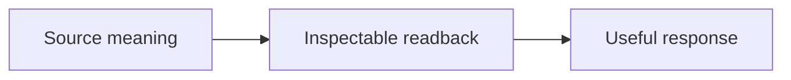

# Readback First

**0.8.2 — Unresolved-item lineage and unambiguous package versions**

Make the AI's working understanding inspectable before it responds or acts.
Preserve qualifiers, corrections and open items. Readback is neither factual
verification nor action authorization.

[中文](README.zh-CN.md) · [Protocol](PROTOCOL.md) · [This iteration](docs/releases/0.8.2.md) · [Version sequence](docs/release-sequence.md)

## What this version changes

- Keep received content at the specificity supplied by the user; label useful inference separately.
- Preserve source wording without unnecessary clarification when the missing distinction does not matter.
- Retain [raw baseline and candidate observations](docs/evaluation/reception-continuation/review.md), including failures and limits. Broader alignment remains open.

## Read back, then answer

**User:** “Can a Skill own readback while keeping it mandatory every turn? Do not edit yet.”

Readback: You want the detailed protocol in a Skill, with mandatory every-turn
application. This turn is discussion only.

Yes. The host entry can require it while the Skill owns reception and expression.
I recommend comparing real replies before replacing old rules, so corrections,
source coverage and useful continuation survive the move.

## Install the latest version

The default `main` branch contains **v0.8.2**. Ask your agent:

> Install the Skill at https://github.com/KO2048/readback-first from the repository
> root on main, named readback-first. If already installed, preserve local changes
> and update it to the latest main version.

For a new Codex installation, the manual equivalent is:

```bash
git clone --branch main --depth 1 https://github.com/KO2048/readback-first.git ~/.codex/skills/readback-first
```

Do not run the clone over an existing directory. For a Git-based installation,
review local changes before updating with `git pull --ff-only origin main` from
that installation; other installations can be updated by the agent/installer.
Reload the Skill or start a new session as your host requires. Check `release.json`
for version `0.8.2`; installing this Skill does not itself update host rules.

To apply it on **every user turn**, add the small required entry from
[the always-on host profile](docs/always-on.md) to your host's always-loaded
instructions. For reproducibility, [v0.8.2](https://github.com/KO2048/readback-first/releases/tag/v0.8.2)
provides a pinned release snapshot.

## Evidence and status

**39 deterministic fixtures** and a contract consistency check are provided:

```bash
python3 tests/validate_contract.py
python3 tests/validate_fixtures.py
```

These checks do not run a model. The [v0.8.2 runtime report](docs/evaluation/reception-continuation/review.md) archives three three-turn baseline conversations, ten baseline micro samples, five candidate micro samples and a three-turn candidate replay; broader runtime behavior, loading and rendering remain pending. This is a published 0.x protocol/Skill release, not a claim of
cross-model reliability. It does not silently replace global rules. See the [evaluation matrix](tests/runtime-matrix.md).

[Complete examples](examples/before-after.md) · [Changelog](CHANGELOG.md) · Apache-2.0

## Semantic views / 语义视图



Use different diagrams for different relationships; inferred links need labels.
根据不同关系分别选图；推测关系必须标识。See examples/before-after.md.

[Mandatory every-turn adapter / 每轮强制入口](docs/always-on.md)

[本版示例 / Worked example](examples/identity-current-view.md) · [本版实际观察 / Runtime observations](docs/evaluation/versioned/identity-current-view/review.md)

[本版示例 / Worked example](examples/unresolved-lineage.md) · [本版实际观察 / Runtime observations](docs/evaluation/versioned/unresolved-lineage/review.md)
