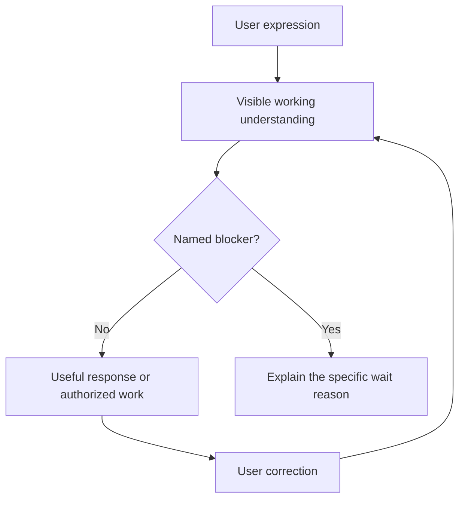

# Readback First

**See what AI is about to use—before it keeps going.**

> Speak freely. AI reads it back, then normally continues.

Readback First is a protocol and reference Agent Skill that makes **default readback**
visible before an AI relies on a user's expression. It shows the AI's visible
working understanding, continues when the next step is safe, and lets the user
interrupt and correct it at any time.

**Delivery boundary:** When loaded by a compatible host, the Skill treats
readback as the default behavior. Automatically loading it on every meaningful
turn still requires host integration.

[中文](README.zh-CN.md) · [Same-source example](examples/before-after.md) ·
[Protocol 0.4](PROTOCOL.md) · [39 deterministic fixtures](tests/README.md) ·
Apache-2.0

## The idea, in one scene

At a restaurant, the server reads a changed order back before sending it to the
kitchen:

> “Two burgers instead of the steaks; one fries, two drinks, one mushroom soup,
> and one corn soup. About eight minutes. Is that right?”

The readback makes the working order visible before a consequential action.
Readback First applies the same idea to AI: **show what will be used before
answering or acting**. For an ordinary in-chat response, the AI can continue
after the readback and the user can interrupt. For consequential actions, the
host's normal confirmation and authorization gates still apply.

## Same input, different outcome

**User:** “I want to move readback from global rules into a Skill, but keep it
mandatory on every turn. Is that feasible? Do not change anything yet.”

**Weak response:** “Received: migrate readback. Please confirm before I analyze.”

**Better response:**

Readback: You want a Skill to own the detailed protocol while keeping mandatory
every-turn application. This turn is discussion only.

Yes. The always-loaded host instructions can require the Skill, while the Skill
owns reception, presentation and continuation. I recommend comparing real
responses before replacing the detailed rules, so corrections, unresolved items
and authorization boundaries survive the migration.

| Layer | Responsibility |
| --- | --- |
| Global entry | Apply the Skill on every user turn |
| Skill | Read back, choose suitable views, then respond |
| Host authority | Govern consequential action |

See [complete response examples](examples/before-after.md) and the
[user-supplied WorkBuddy case](examples/workbuddy-case.md).

## Why it exists

People should not need to become prompt engineers before they can think out
loud.

Long messages, voice transcripts, corrections, uncertain ideas, references
like “the previous version,” and last-minute constraints are normal human
expression. An AI can produce a polished, plausible response while dropping a
qualifier, merging two ideas, accepting a candidate as a decision, or acting on
the wrong interpretation.

The problem is not only what the user said. It is whether the user can inspect
what the AI says it is preparing to use.

## What the Skill does

Readback First:

- reads back meaningful input by default before a substantive response;
- preserves facts, requests, reasons, qualifiers, corrections, questions, and
  unfinished content instead of replacing them with a summary;
- normally continues after readback for closed, source-adequate, in-chat work;
- lets user corrections interrupt provisional work and invalidate only
  dependent output;
- chooses readback density and organization without showing a standing mode
  menu;
- handles low-impact uncertainty with a visible working assumption and uses a
  recommendation-first question only when ambiguity materially changes the
  result;
- separates reception state, decision state, factual truth, and action
  authorization.

It waits when the input is still open, the source is inadequate, a material
ambiguity blocks the next safe step, the user asks for confirm-first/readback-
only behavior, formal propagation requires confirmed coverage, or the host
requires safety/action authorization.

It is not:

- a chain-of-thought viewer;
- a speech-to-text engine;
- a generic summarizer;
- proof that user claims are factually true;
- permission for an agent to write, send, purchase, commit, push, or publish.

## Install

### Codex

Ask Codex to install the Skill from the repository root:

```text
$skill-installer install --repo KO2048/readback-first --path . --name readback-first
```

Or clone it manually:

```bash
git clone https://github.com/KO2048/readback-first.git \
  ~/.codex/skills/readback-first
```

Restart Codex after installation.

### Other Agent Skills-compatible runtimes

Clone the repository into the runtime's skills directory. The reference Skill
uses the portable `SKILL.md` format, but discovery, invocation, and enforcement
vary by runtime.

## Quick start

```text
Use $readback-first.

I am going to describe a product change freely. Read back what you are
preparing to use, then continue unless a named blocker applies. I will
interrupt if the readback is wrong. Do not perform external actions.
```

Or ask naturally:

```text
Read this back, then keep going unless you need a material clarification.
```

A simple settled request gets a one-line readback and same-turn answer. A long
or voice-like input gets a more inspectable readback, followed by a provisional
response when safe. A direct-answer request may shorten or omit visible
readback, but never bypasses safety or action authority.

### Important host boundary

The reference Skill specifies behavior **when the host loads it**. Making it run
automatically on every meaningful turn requires compatible **host integration**;
installing `SKILL.md` alone cannot prove default delivery across every runtime.

## Protocol



Readback shown is not reception confirmed. Reception confirmation is neither
factual verification nor action authorization.

## Tests and evidence

```bash
python3 tests/validate_fixtures.py
python3 tests/validate_contract.py
```

The repository includes **39 deterministic fixtures** for compression,
premature closure, correction lineage, qualifier loss, invented intent,
confirmation overreach, default-readback omission, proceed/wait routing,
interrupting corrections, mode-menu fatigue, uncertainty handling, and action-
authority bypass.

These fixtures validate named protocol invariants against hand-authored JSON.
They do not run a model or prove cross-runtime reliability. Broader product
claims require fixed prompts, raw runtime outputs, repeated runs, and declared
model/host versions.

## Status

Protocol 0.4 is a **public candidate** and is **not a tagged stable release**.
The protocol, Skill contract, and fixtures are implemented in this candidate;
broader runtime evidence and host integrations are still being validated.

This project does not include voice recognition, a desktop input method,
plugins, external actions, or a hosted service. Voice input is an important use
case, not a capability claimed by this repository.

## Roadmap

- Publish reproducible same-source runtime evaluations.
- Test verified compatibility across agent runtimes.
- Design a visual Readback Receipt for voice and long-form input.
- Evaluate input-method adapters only after the interaction proves useful.

## Contributing

Useful contributions include:

- minimal examples where an AI produced a reasonable but wrong interpretation;
- fixtures for corrections, qualifiers, ambiguity, and continuing input;
- runtime installation and behavior verification;
- clearer language that preserves protocol and authority boundaries.

Try it on one real freeform input. If the readback reveals a mismatch—or misses
one—share the same-source case. Star the repository to follow new evaluations,
runtime adapters, and interaction experiments.

## License

Apache License 2.0.

## 0.4 candidate / 候选迭代

Natural readback is followed by a useful answer when no blocker applies. Keep
source, interpretation and evidence separate. Use multiple content-driven views
instead of a machine-record template or a compulsory single diagram.

回讲使用自然正文；输入已收束且无阻塞时继续给出判断、理由与建议或执行已授权任务。
按内容分段，选择文字、表格和不同 Mermaid 类型；等待续述、澄清、确认分别处理。

- [Complete responses / 完整回应](examples/before-after.md)
- [WorkBuddy supplied case / 用户提供的实测案例](examples/workbuddy-case.md)
- [Mandatory every-turn integration / 每轮强制应用](docs/always-on.md)
- [Evaluation matrix / 效果验证](tests/runtime-matrix.md)

Runtime replication and renderer verification remain pending. This candidate
does not yet replace the user's global rules or claim equivalent model behavior.
实测复现与渲染验证仍待完成，尚未替换全局规则，不能声称已复现同等效果。
