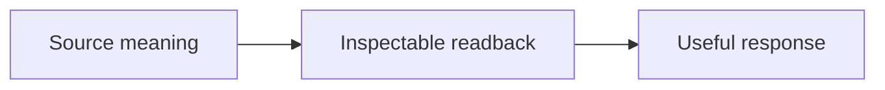

# Readback First

**0.8.1 — 问题身份与完整当前稿**

先让用户看清 AI 接收到什么，再进行实质回应。回讲保留原意、限定、修正与未决项；
回讲不等于事实核验或行动授权。

[English](README.md) · [协议](PROTOCOL.md) · [本版迭代记录](docs/releases/0.8.1.md) · [版本路线](docs/release-sequence.md)

## 本版解决什么

- 用户只说“九点”，回讲不能直接写成用户说了“晚上九点”。合理理解与来源事实分开。
- 当前任务不依赖早晚时，保留原说法继续，不因此增加确认关卡。
- 保留[原始失败、微测试与三轮回归](docs/evaluation/reception-continuation/review.md)。本版是限定修复，不代表全面对齐。

## 回讲之后，继续回答

**用户：**“我想把回讲迁入 Skill，但每次都要用。你认为可行吗？先别修改。”

回讲：你希望由 Skill 承载详细逻辑，同时保持每次应用；这次只讨论，不修改。

可行。全局入口可以规定每轮应用，Skill 负责回讲的内容与表达。我建议先验证
原意、修正和后续回应是否保留，再替换旧规则，避免只换了文件位置却损失效果。

## 安装最新版

默认 `main` 已包含 **v0.8.1**。可以直接对 Agent 说：

> 从 https://github.com/KO2048/readback-first 的 main 分支安装仓库根目录中的 Skill，
> 名称为 readback-first。如果已经安装，先保留本地改动，再更新到最新版。

全新 Codex 安装也可以使用：

```bash
git clone --branch main --depth 1 https://github.com/KO2048/readback-first.git ~/.codex/skills/readback-first
```

已有目录不要直接覆盖。Git 安装先检查本地改动，再在安装目录执行
`git pull --ff-only origin main`；其他安装方式交由 Agent／安装器更新。
按宿主要求重新加载或新开会话，并检查 `release.json` 中的版本为 `0.8.1`。

要求**每条输入都应用**时，将[强制宿主入口](docs/always-on.md)放入宿主始终加载的规则。
安装 Skill 与配置这个入口分别完成；需要固定版本时使用
[v0.8.1 发布快照](https://github.com/KO2048/readback-first/releases/tag/v0.8.1)。

## 验证与限制

本版有 **39 个确定性 fixtures**。检查：

```bash
python3 tests/validate_contract.py
python3 tests/validate_fixtures.py
```

这些检查不调用模型。跨模型实际回复质量、宿主加载和渲染仍待验证。本版发布协议与 Skill 实现，
不宣称跨模型可靠性已证明，也不会静默替换你的全局规则。参见[验证矩阵](tests/runtime-matrix.md)。

[完整示例](examples/before-after.md) · [变更记录](CHANGELOG.md) · Apache-2.0

## Semantic views / 语义视图



Use different diagrams for different relationships; inferred links need labels.
根据不同关系分别选图；推测关系必须标识。See examples/before-after.md.

[Mandatory every-turn adapter / 每轮强制入口](docs/always-on.md)

[本版示例 / Worked example](examples/identity-current-view.md) · [本版实际观察 / Runtime observations](docs/evaluation/versioned/identity-current-view/review.md)
