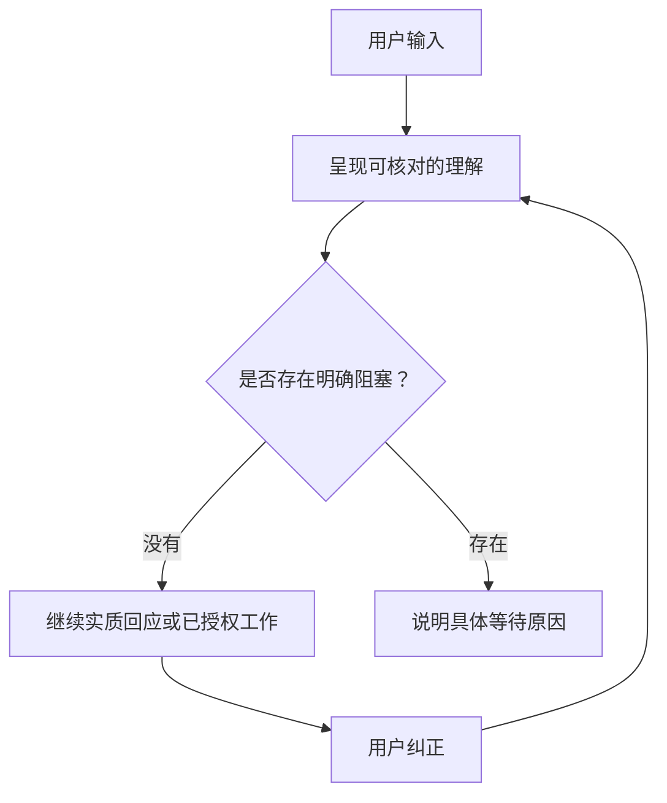

# Readback First

**先看见 AI 准备采用什么，再让它继续。**

> 自由表达。AI 先回讲，然后正常推进。

Readback First 是一套协议和参考 Agent Skill：让 AI 在依据用户表达回答
或行动前，**默认回讲**它准备采用的可见工作理解；没有明确阻断条件时
正常继续，用户发现偏差可以随时打断纠正。

**交付边界：**参考 Skill **被兼容宿主加载后**，默认执行回讲；若希望每个
有意义的 turn 都自动加载，仍需要宿主集成。

[English](README.md) · [同源完整案例](examples/before-after.md) ·
[协议 0.4](PROTOCOL.md) · [39 个确定性 fixtures](tests/README.md) ·
Apache-2.0

## 理想中，我们和 AI 的对话，应该很像我们去餐厅点餐

**顾客：**“上次那个双人套餐再来一份，其中一份汤换成玉米汤。我们很饿，能快点上吗？”

**服务员：**“您说的是上次点过的 A 双人套餐：两份牛排、一份薯条、两杯饮料和两份蘑菇汤；这次把其中一份蘑菇汤换成玉米汤，其他不变。这个套餐正常需要二十分钟左右上齐，对吗？”

**顾客：**“菜单对。但二十分钟太久了。最快的是什么？”

**服务员：**“汉堡最快，大约八分钟。可以把两份牛排换成两份汉堡，其他内容保持不变。”

**顾客：**“那就换成汉堡。”

**服务员：**“好的，两份牛排改为两份汉堡；薯条一份、饮料两杯、蘑菇汤一份和玉米汤一份保持不变，预计八分钟左右上齐，对吗？”

**顾客：**“对。”

**服务员：**“好的，现在为您提交后厨。”

服务员在把订单提交给后厨前，先向顾客复单，让双方看见的是同一份
订单。这也是 Readback First 名字的来源：**正式开工前，先回讲。**

点餐提交后厨是现实行动，因此需要确认。普通 AI 会话内的回答可以在
回讲后正常继续，用户随时打断纠正；写文件、发消息、push、publish 等
行动仍走宿主原有的确认和授权门禁。

## 同一份输入，两种结果

**用户：**“我想把回讲能力从治理文档迁入 Skill，但每次仍要自动使用。你认为可行吗？先别修改。”

**不充分的回应：**“已收到：迁移回讲。请确认后我再分析。”

**更好的回应：**

回讲：你希望由 Skill 承载详细回讲逻辑，同时保留每次自动应用；这次只讨论可行性，不修改。

可行。全局入口可以强制应用 Skill，Skill 再根据内容选择回讲深度与回应方式。
这样能集中维护协议，但迁移时要保留原有的修正链、未决项和授权边界。
我建议先以现有真实对话比较新旧效果，通过后再替换详细规则。

| 层次 | 职责 |
| --- | --- |
| 全局入口 | 每条用户输入强制应用 Skill |
| Skill | 接收、表达、继续回应、必要澄清 |
| 宿主权限 | 判断实际操作是否已获授权 |

查看[完整回应示例](examples/before-after.md)与[用户提供的 WorkBuddy 实测案例](examples/workbuddy-case.md)。

## 为什么需要它？

用户不应该先成为 Prompt 工程师，才能把真实想法告诉 AI。

大段自由表达、语音转写、说到一半改口、“还是刚才那个版本”、临时
补充条件，都是正常的人类表达。AI 可能给出流畅、合理、甚至很专业的
回答，却静默遗漏限定语、错误合并观点、把候选当成结论，或依据错误
理解开始行动。

问题不只在于“用户说了什么”，还在于：

> 用户能否看见 AI 声称自己准备采用什么。

## Skill 能做什么？

- 在实质回答前，默认回讲有意义的用户输入；
- 保留事实、请求、理由、限定、修正、问题和未完成内容，不用摘要替代；
- 对已闭合、来源足够的会话内工作，回讲后正常继续；
- 用户纠正可以打断临时工作，只使依赖旧理解的输出失效；
- AI 主动选择回讲详略和组织方式，不长期展示参数或模式菜单；
- 低影响不确定采用可见的工作假设并继续；只有不同理解会实质改变结果
  时，才按“判断、依据、影响、建议、最小问题”的顺序请求确认；
- 把接收状态、决策状态、事实真实性和行动授权分开。

以下情况才停等：用户还没说完、来源不足、关键歧义阻断下一步、用户
明确要求先确认或只回讲、正式传播需要确认接收覆盖，或宿主要求安全/
行动授权。

它不是：

- 思维链查看器；
- 语音识别或转写引擎；
- 普通总结 Prompt；
- 对用户陈述真实性的证明；
- 写文件、发消息、付款、commit、push 或 publish 的行动授权。

## 安装

在 Codex 中从仓库根目录安装：

```text
$skill-installer install --repo KO2048/readback-first --path . --name readback-first
```

或者手动 clone：

```bash
git clone https://github.com/KO2048/readback-first.git \
  ~/.codex/skills/readback-first
```

安装后重启 Codex。

其他兼容 Agent Skills 的运行时可把仓库放入自己的 skills 目录，但发现、
调用和执行机制可能不同。

## 快速使用

```text
Use $readback-first.

接下来我会自由描述一个产品修改。请先回讲你准备采用的理解；
没有明确阻断条件时直接继续。如果回讲不对，我会随时打断。
不要执行外部行动。
```

也可以自然地说：

```text
先回讲，然后继续；只有存在会改变结果的歧义时再问我。
```

简单、已收束请求采用一句回讲并同轮回答；长段或语音式输入采用更容易
核对的回讲，安全时继续给出临时回答。显式直答可以缩短或省略可见回讲，
但不能绕过安全和行动权限。

### 重要的宿主边界

参考 Skill 只能规定**宿主加载它之后**应该怎样工作。若希望每个有意义的
输入都自动触发，还需要兼容的**宿主集成**；仅安装 `SKILL.md` 不能证明
所有运行时都会默认加载。

## 核心流程



已回讲不等于已确认接收；语义接收确认不等于事实核验，也不等于行动授权。

## 测试与证据

```bash
python3 tests/validate_fixtures.py
python3 tests/validate_contract.py
```

仓库包含 **39 个确定性 fixtures**，覆盖未授权压缩、中途封口、修正覆盖、
限定语遗漏、擅自补全意图、确认越权、默认回讲缺失、继续/停等路由、
打断式纠正、模式菜单疲劳、不确定处理和直答绕过行动授权。

这些 fixtures 只验证手写 JSON 中的具名协议不变量，不会调用模型，也不能
证明跨运行时可靠性。更强的产品结论需要固定输入、原始运行输出、多次重复
以及明确的模型和宿主版本。

## 当前状态

协议 0.4 是 **public candidate**，**不是已打 tag 的稳定版本**。本候选已
实现协议、Skill 契约和 fixtures；更广泛的运行时证据与宿主集成仍待验证。

本项目不包含语音识别、桌面输入法、插件、外部行动或在线服务。语音输入
是重要使用场景，不是本仓库已经具备的能力。

## 路线图

- 发布可复现的同源运行时评估；
- 验证不同 Agent 运行时的兼容性；
- 设计适合语音和长段输入的可视化 Readback Receipt；
- 在交互价值得到验证后，再评估输入法 adapter。

## 参与贡献

欢迎贡献：

- AI 产生“合理但错误理解”的最小同源案例；
- 修正、限定语、歧义与连续输入 fixtures；
- 不同 Agent 运行时的安装和行为验证；
- 更清楚但不削弱协议与权限边界的表达。

用一次真实自由输入试试看。如果回讲暴露了偏差——或仍然漏掉了偏差——
请分享同源案例。Star 本仓库可以持续关注新的评估、运行时 adapter 和交互
实验。

## License

Apache License 2.0。

## 0.4 candidate / 候选迭代

Natural readback is followed by a useful answer when no blocker applies. Keep
source, interpretation and evidence separate. Use multiple content-driven views
instead of a machine-record template or a compulsory single diagram.

回讲使用自然正文；输入已收束且无阻塞时继续给出判断、理由与建议或执行已授权任务。
按内容分段，选择文字、表格和不同 Mermaid 类型；等待续述、澄清、确认分别处理。

- [Complete responses / 完整回应](examples/before-after.md)
- [WorkBuddy supplied case / 用户提供的实测案例](examples/workbuddy-case.md)
- [Mandatory every-turn integration / 每轮强制应用](docs/always-on.md)
- [Evaluation matrix / 效果验证](tests/runtime-matrix.md)

Runtime replication and renderer verification remain pending. This candidate
does not yet replace the user's global rules or claim equivalent model behavior.
实测复现与渲染验证仍待完成，尚未替换全局规则，不能声称已复现同等效果。
