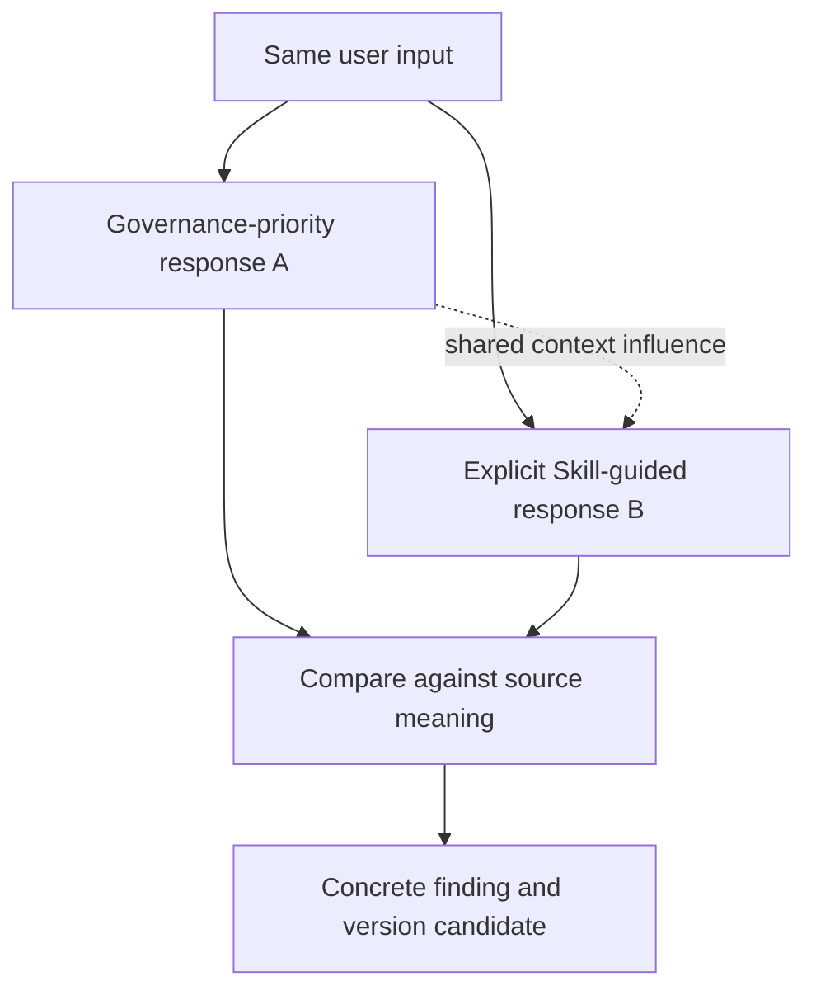

# Governance × Readback First 0.7.0 / 同会话对照

## Purpose / 目的

The user's requested order is: governance response first, explicit separation,
Skill-guided response second, then compare content. Keep current governance.
A Skill call here means reading and applying its instructions; it is not a
separate model or an executable service launched by reading SKILL.md.

顺序为：当前治理回应 → 清楚分隔 → 显式应用 Skill 回应 → 内容对比。保留治理层。
Skill 调用指读取并按指令回应，不意味着另起模型或运行一个独立程序。

## Daily comparison / 日常对照

1. Identify the original input and available prior context. Preserve the raw input.
2. Deliver A as the default governance-priority response, with substantive content
   when appropriate. Do not retrospectively edit it to manufacture a difference.
3. Delimit B visibly and apply the pinned Skill to the same source. B sees the
   shared conversation; label it a same-session comparison, not a Skill-only arm.
4. Compare both against the source, not simply against each other. Neither is a
   gold standard; preserve cases where A is wrong or B is clearer.
5. State agreed content, omissions, unsupported additions, useful organization,
   and quality of continuation. Do not assign causal gains from one pair.

先固定原始输入与可用上下文；治理优先回应 A 后，明确分隔并给出 Skill 指导的 B。
两份都回到原始输入核对，不把 A 自动当正确答案；保留两边缺点。第二份受共享上下文
影响，必须标为同会话对照，不称为纯 Skill 或独立实验。

## Avoid duplicate work / 避免重复动作

The real action is performed once under existing authorization. B may describe
its response and intended next step, but must not repeat writes, messages,
purchases, commits or tests merely to create another arm. Record actual actions
separately. Side effects are not necessary for semantic comparison.

真实动作按已有授权只做一次；B 是回应对照，不重复写入、发消息、提交或测试。
实际动作独立记录，不能让“对比”变成第二次执行。

## Inspection questions / 核对维度

| Dimension | Inspection question / 检查问题 |
| --- | --- |
| Coverage | Are request, cognition, materials, reasons and qualifiers preserved? / 原意是否完整？ |
| Relations | Are correction, support, dependency and open state represented faithfully? / 关系是否准确？ |
| Provenance | Is AI inference distinct from user expression and verified fact? / 有没有擅自补全？ |
| Presentation | Is the output readable and each view useful? / 格式与图是否帮助检查？ |
| Continuation | Does it answer and advance the real request? / 是否继续给出实质回应？ |
| Authority | Do assumptions or described actions exceed permission or evidence? / 是否越权或虚报完成？ |
| Burden | Does it ask unnecessary questions or repeat too much? / 是否增加阅读与确认负担？ |

Use qualitative findings with source spans and output quotes. Pass/fail labels
require an explicit criterion; no unsupported score or percentage of parity.

用原话位置和输出证据记录定性差异；不凭感觉打“达到百分之多少”的分数。

## Independent validation / 独立验证（后续）

For a causal comparison, use separate fresh sessions with the same model,
settings, input and permitted task context. The Skill arm must not inherit A,
legacy governance or this conversation's coaching; the governance arm must not
also load the treatment Skill. Keep host safety in both arms. Record configurations,
loading evidence and all raw outputs, including failures. If isolation cannot be
verified, retain the observational label and do not claim independent results.

需要判断 Skill 单独贡献时，另建相同模型与条件的独立会话；不互相看到答案，不将
旧治理和这段训练式对话带进 Skill 组。两组均保留宿主安全要求。隔离不可核验时，
继续标为观察性证据。本轮未启动这样的独立实验。

## Session scope / 生效范围

This comparison format is for the current evaluation task. It does not rewrite
global response rules or require duplicate answers in unrelated conversations.
The installed Skill will be available on the next turn; current manual reading
and application is not proof of automatic skill-catalog discovery.

此方式用于当前对比任务，不回写成所有会话都输出两遍的全局规则。下一轮可使用
已安装 Skill；本轮人工读取应用不证明技能目录已自动发现或未来每轮加载成功。
