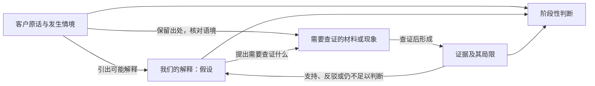
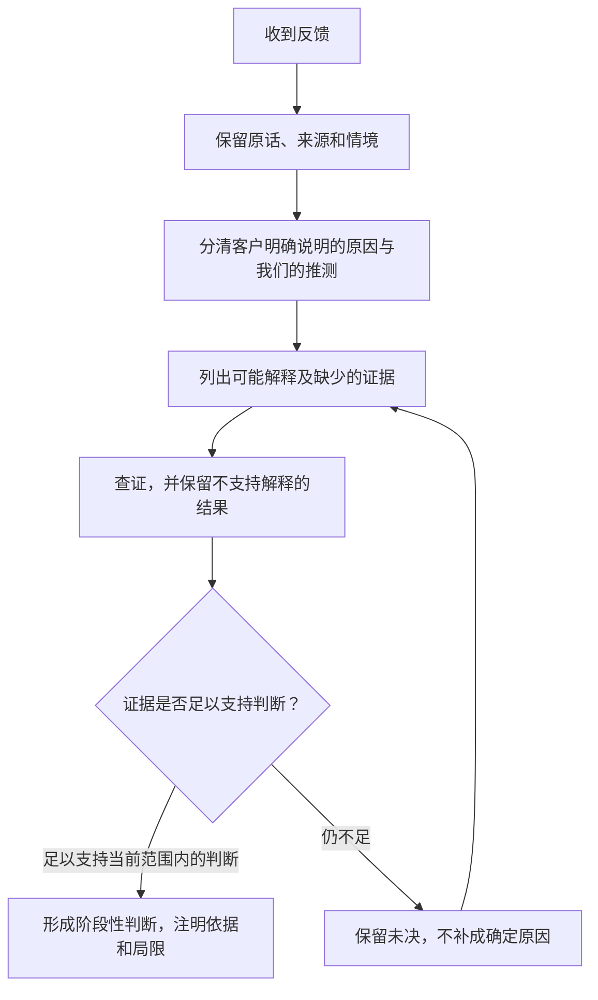

回讲：这次把方向整理成团队讨论用的一段文字，直接放在这里，不发送。“最近7天没有再回来”仅作“刚刚流失”的未批准占位，尚未决定据此筛人；不做筛选规则、不建任务、保留老用户问题这些边界继续有效。下面分别画清证据关系和判断顺序，最后给出建议。

:::writing{variant="document" id="58193"}
我们想讨论如何在收集客户反馈时，更完整地保留客户为什么这样说，以及我们凭什么作出解释。客户原话、我们提出的解释和支持或反驳解释的证据需要区分：例如，“首页太乱”只是讨论用的假设例子，“可能找不到正在进行的比赛”是我们的猜想，两者都不是已取得的客户证据。“反馈量大不一定代表问题重要”，当前理由是“样本可能有偏”；此前“那群人特别愿意说话”保留为旧解释。关注方向已从“优先新用户”调整为“先看刚刚流失的人”，“最近7天没有再回来”暂作未批准的口径占位，尚未决定按它筛人。老用户的问题仍须保留。本次只讨论方向及判断依据，不制定筛选规则、不建任务，也不表示这套方法已经落地。
:::

下面是我建议用于讨论的关系表达。**证据可能支持解释，也可能推翻解释；解释不能反过来充当客户原话。**

从收到反馈到形成判断，可以按下面的顺序讨论；这是建议的理解过程，尚未成为执行规则。

我的建议是，团队先用一条真实反馈讨论这几个环节是否帮助大家看清“客户说了什么、我们猜了什么、还缺什么”。“流失”口径暂时保持未决，先检验这种区分是否有用，再决定后续如何使用；反馈数量仍可作为信息，但不能单独承担重要性判断。
