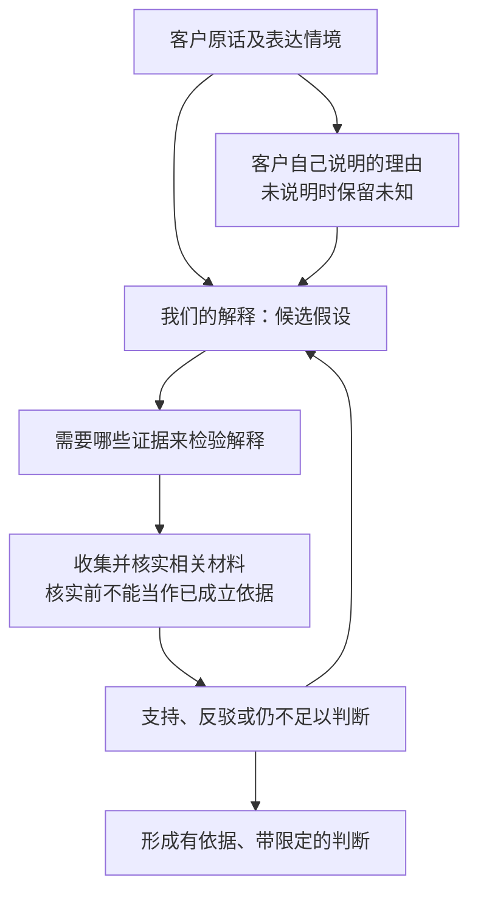
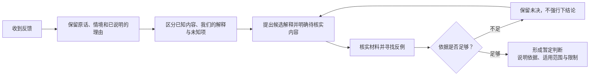

回讲：你要一段直接放在这里、供团队讨论的草稿，不是发送给团队。“最近7天没有再回来”只作为“刚刚流失”的未批准占位，不能据此筛人；不做筛选规则、不建任务、保留老用户问题的限制继续有效。下面会分别表达信息之间的关系和判断顺序，再给建议。

:::writing{variant="document" id="48619"}
我们想讨论是否调整客户反馈的收集方式，把重点放在保留客户为什么这样说，而不只是收集更多意见。客户原话、客户自己说明的理由、我们的解释，以及需要补充核实的证据应当分开保留：“首页太乱”只是讨论用的例子，“可能找不到正在进行的比赛”是我们的猜想，没有已知客户来源，不能当成客户已说过的原因。我们保留这个认知：“反馈量大不一定代表问题重要”；当前原因表述为“样本可能有偏”，旧解释“那群人特别愿意说话”仍保留为被替换的表述。讨论关注点已从“优先新用户”改为“先看刚刚流失的人”，其中“最近7天没有再回来”仅是尚未批准的口径占位，也未决定据此筛人。老用户的问题继续保留。本轮仅讨论方向，不制定筛选规则、不建任务，也不表示这套方法已经落地。
:::

下面两张图是我提出的讨论结构，具体方法尚未定案。

客户原话能证明对方表达了什么；对方给出的理由也不自动等于已经验证的原因。我们的解释需要接受证据检验，不能反过来补写成客户原话。前面的“首页太乱”只是示例，不是这张图中已经收到的真实材料。

**我的建议是继续推进这个方向，先用少量已有真实反馈检验这种区分是否有帮助。**重点看它能否让团队辨认：哪些是客户实际表达的，哪些是我们补充的解释，哪些还不知道。反馈数量可以参与判断，但不应单独决定重要性。

“最近7天没有再回来”目前适合留在讨论稿里作为占位，不宜承担筛选依据；老用户问题继续保留。以上是讨论草稿和建议，尚未实施。
