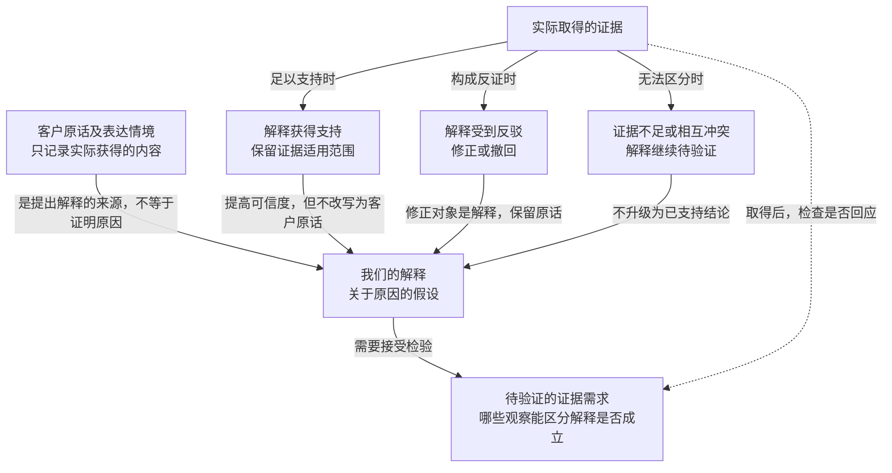
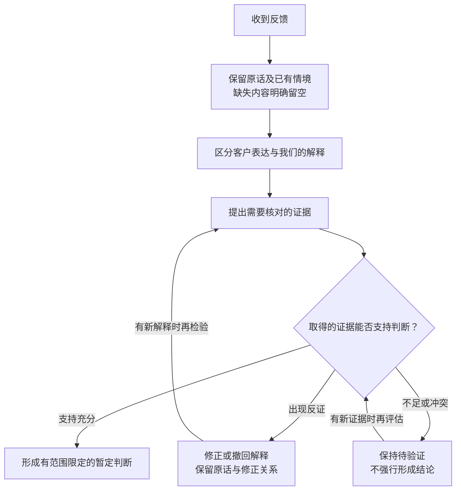

回讲：你现在要把这个方向整理成**可供团队讨论的文字，直接放在这里**，并分别画清楚信息之间的关系、形成判断的先后顺序，最后给出我的建议。边界仍然是只讨论：不写文件、不发送、不建任务、不制定筛选规则，也不能声称已经落地。

我会保留这些限定和修正：

- 重点是理解别人为什么这样说，不是追求收集更多意见。“首页太乱”只是举例；“可能找不到正在进行的比赛”是我们的猜想，不能冒充客户说过的话，也不为它补造客户来源。
- 最初的“优先新用户”已撤回，当前关注方向改为“刚刚流失的人”。“最近7天没有再回来”只是临时占位，尚未获批成为流失口径，也没有被批准用于筛人。老用户的问题继续保留。
- **“反馈量大不一定代表问题重要”**原样保留。当前原因表述改为“样本可能有偏”；原先的“那群人特别愿意说话”保留为旧解释，不当作已证实原因。这句话以后可以用于分享材料，本次不生成宣传稿。

下面是讨论草稿，其中的信息关系和判断步骤是我的组织建议，尚未成为团队规则。

:::writing{variant="document" id="58173"}
我们想讨论是否调整客户反馈的收集方式，把重点放在保留客户为什么这样说，而不只是收集更多意见。讨论时应分清客户实际说过的话、我们提出的解释，以及支持或反驳解释所需的证据。例如，“首页太乱”目前只是一个示例，“他可能找不到正在进行的比赛”则是我们的猜想，两者都不能包装成已有客户案例。我们此前提出“优先新用户”，现已撤回，改为先关注“刚刚流失的人”；“最近7天没有再回来”暂作讨论占位，尚未批准为流失定义，也未决定按它筛人，老用户的问题仍须保留。“反馈量大不一定代表问题重要”：目前用“样本可能有偏”解释这一提醒，原先“那群人特别愿意说话”的解释保留为修正前的表述，二者均不应当作已经验证的结论。本次只讨论这个方向是否有助于形成更可靠的判断，不制定筛选规则、不建立任务，也不代表这套方法已经实施。
:::

**客户原话、解释与证据的关系**

客户原话能证明客户表达了什么，但不会自动证明我们对原因的解释。证据需要有机会支持或反驳解释；尚未取得证据，只能留下待验证的问题。

对应到你的例子：“首页太乱”放在**示例表达**的位置；“可能找不到正在进行的比赛”放在**解释假设**的位置。至于客户当时想做什么、是否尝试找比赛、具体在哪里受阻，只能列为**可能需要核对的证据**，不能写成已经观察到的事实。

**从收到反馈到形成判断的顺序**

这张图表达建议中的判断顺序，没有把“最近7天没有再回来”加入筛选步骤，也没有把反馈数量直接连接到重要性结论。

我的建议是：**这个方向值得继续讨论，优先检验“分开原话、解释和证据，能否减少误判”这一点。**它能帮助团队发现自己在哪一步加入了猜想，也让不同解释有机会接受检验。代价是需要更仔细地保留情境，但不必现在就扩展成完整流程或筛选制度。

同时，原因得到支持和问题值得优先解决仍是两次判断：前者回答“为什么发生”，后者还需要考虑影响与严重程度。关注刚刚流失的人可以作为观察方向；目前应保留占位口径和老用户问题，让讨论继续，而不提前据此排除反馈。
