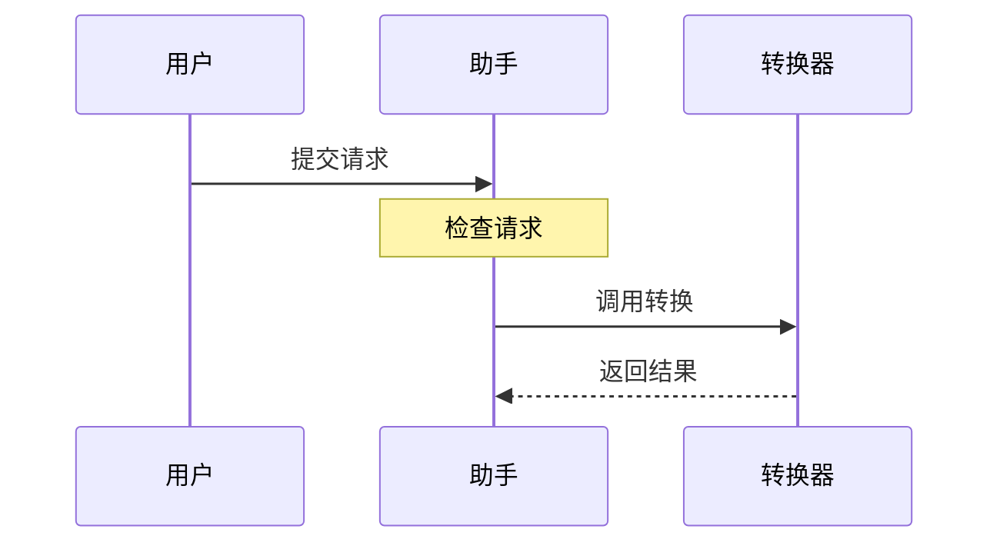
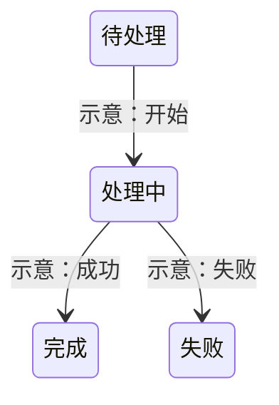
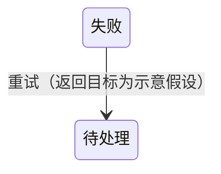

# Complete response examples

These are authored reference examples, not recorded runtime results.

## Closed input: read back, then answer

User:

> 我想把回讲能力从治理文档迁入 Skill，但每次仍要自动使用。你认为可行吗？先别修改。

### Plausible failure

> Received: migrate readback. State: WAITING_FOR_CONFIRMATION. 请确认后我再分析。

### Better response

回讲：你希望由 Skill 承载详细回讲逻辑，同时保留每次自动应用；这次只讨论可行性，不修改。

可行。全局入口可以强制应用 Skill，Skill 再根据内容选择回讲深度与回应方式。
这样能集中维护协议，但迁移时要保留原有的修正链、未决项和授权边界。
我建议先以现有真实对话比较新旧效果，通过后再替换详细规则。

| 层次 | 职责 |
| --- | --- |
| 全局入口 | 每条用户输入强制应用 Skill |
| Skill | 接收、表达、继续回应、必要澄清 |
| 宿主权限 | 判断实际操作是否已获授权 |

## Mixed content: separate views

User:

> 只画示意：用户提交后，助手先检查，再调用转换器，转换器返回结果。任务有待处理、处理中、完成、失败四种状态。不要启动转换。

回讲：你要看交互顺序和任务状态两个视角；只做示意，不启动转换。

交互顺序如下：

你列出的四个状态可以分别检查。下面的转换关系是我的示意假设，
不是你已经确认的状态规则：

交互图说明谁先与谁交互；状态图说明任务可能如何变化。失败后的重试规则你尚未提出，暂不补入。

## Correction without restarting everything

User:

> 上面改一下：失败后允许重试，其他都保留。

回讲：你补充“失败后允许重试”，其余交互和状态保持原样。

这只影响失败后的状态转换。下面把重试返回待处理作为待确认的示意；
如果实际要直接进入处理中，需要调整这一条，其他内容不受影响。

## Trace note for evaluators

The closed advisory example uses `response_route: proceed_with_provisional_response`
and `reception_state: shown`, not user confirmation. A correction marks only
its dependent provisional output `needs_revision`; retain unrelated content and
all source qualifiers. This note is evaluation bookkeeping, not part of the
normal user-facing response.
