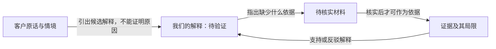
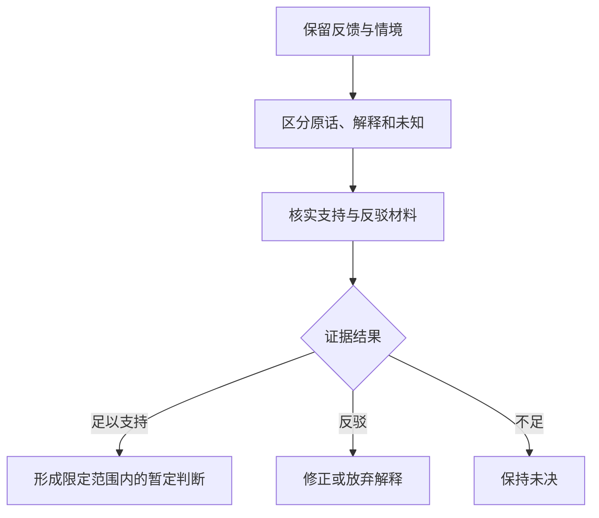

# 图文一致性回归示例 / Diagram consistency reference

This is an authored reference, not a sampled answer or rendering proof.
来源：三轮观察 B3。目标：关系图与流程图各自保留证据门禁，不新增业务规则。

关系图回答“什么内容与什么内容是什么关系”：

流程图回答“下一步取决于什么条件”：

“最近7天没有再回来”如果只是未批准占位，就不应出现“按7天规则筛人”的执行
节点。不能只在正文声明未批准，再在图里默认实施。不同视图可以使用同一种图类型。
